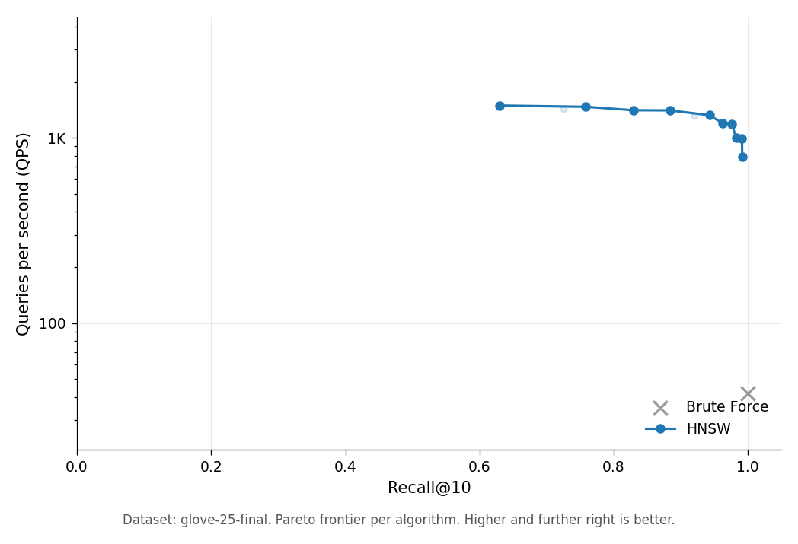

# vicinity

[](https://crates.io/crates/vicinity)
[](https://docs.rs/vicinity)

Nearest-neighbor search.

```toml
[dependencies]
vicinity = { version = "0.3", features = ["hnsw"] }
```

```rust
use vicinity::hnsw::HNSWIndex;

let mut index = HNSWIndex::builder(128)
    .m(16)
    .ef_search(50)
    .auto_normalize(true)
    .build()?;

index.add_slice(0, &[0.1; 128])?;
index.add_slice(1, &[0.2; 128])?;
index.build()?;

let results = index.search(&[0.1; 128], 5, 50)?;
```

## Benchmark

HNSW (M=16) on GloVe-25 (1.18M vectors, 25-d, cosine):

<p align="center">
  
</p>

63–99% recall@10 at 800–1500 QPS. Brute force provides the recall=1.0 baseline at ~42 QPS. Full numbers in `doc/benchmark-results.md`.

## Algorithms

Stable: HNSW, NSW, IVF-PQ, PQ, RaBitQ, SQ8.

Experimental (behind feature flags): Vamana/DiskANN, SNG, DEG, ScaNN, KD-Tree, Ball Tree, RP-Forest, K-Means Tree.

Each algorithm is behind its own feature flag. Default: `hnsw`. Additional flags: `nsw`, `ivf_pq`, `scann`, `diskann`, `vamana`, `quantization`, `rabitq`, `saq`, `persistence`, `parallel`, `experimental`, `python`.

See [docs.rs](https://docs.rs/vicinity) for the full API and [doc/benchmark-results.md](doc/benchmark-results.md) for numbers.

## License

MIT OR Apache-2.0
