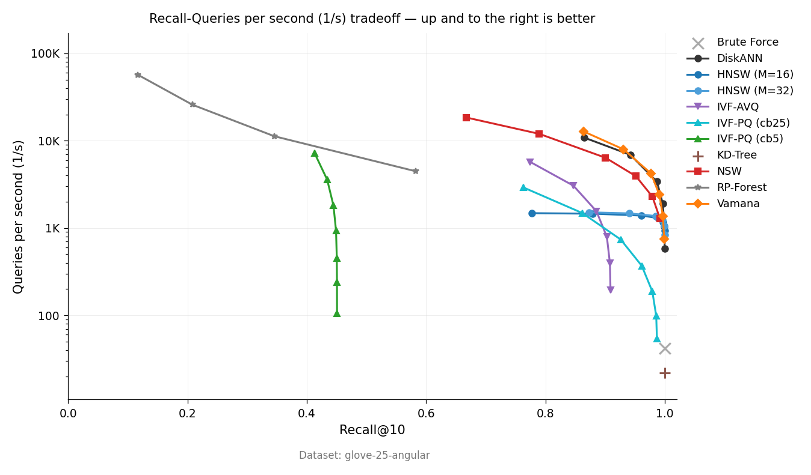

# vicinity

[](https://crates.io/crates/vicinity)
[](https://docs.rs/vicinity)
[](https://pypi.org/project/pyvicinity/)

Approximate nearest-neighbor search.

`vicinity` provides Rust indexes and Python bindings for vector search. HNSW is
the default in-memory index. IVF-PQ is the compressed in-memory index. Other
indexes are feature-gated and documented in
[`docs/algorithms.md`](docs/algorithms.md).

## Install

```toml
[dependencies]
vicinity = { version = "0.10.5", features = ["hnsw"] }
```

Optional features enable additional indexes:

```toml
vicinity = { version = "0.10.5", features = ["ivf_pq"] }
vicinity = { version = "0.10.5", features = ["diskann"] }
vicinity = { version = "0.10.5", features = ["hnsw", "serde"] }
```

## HNSW

HNSW is the default index for dense vectors that fit in memory. Cosine distance
expects unit-norm vectors unless `auto_normalize(true)` is set.

```rust
use vicinity::hnsw::HNSWIndex;

let mut index = HNSWIndex::builder(128)
    .m(16)
    .ef_search(50)
    .auto_normalize(true)
    .build()?;

index.add_slice(0, &[0.1; 128])?;
index.add_slice(1, &[0.2; 128])?;
index.build()?;

let results = index.search(&[0.1; 128], 5, 50)?;
// Vec<(doc_id, distance)>; lower distance is closer.
```

Use `DistanceMetric` when you need L2, angular, or inner-product distance:

```rust
use vicinity::{distance::DistanceMetric, hnsw::HNSWIndex};

let index = HNSWIndex::builder(384)
    .metric(DistanceMetric::L2)
    .build()?;
```

## IVF-PQ

IVF-PQ stores compressed vectors and searches an inverted file. Use it when raw
vectors dominate memory and lower recall is acceptable.

```rust
use vicinity::ivf_pq::{IVFPQIndex, IVFPQParams};

let params = IVFPQParams {
    num_clusters: 1024,
    num_codebooks: 8,
    nprobe: 16,
    ..Default::default()
};

let mut index = IVFPQIndex::new(128, params)?;
for (id, vector) in dataset.iter().enumerate() {
    index.add_slice(id as u32, vector)?;
}
index.build()?;

let compressed = index.search(&query, 5)?;
let reranked = index.search_reranked(&query, 5, 200)?;
```

`search()` uses PQ distances and works after `compact()`. `search_reranked()`
keeps raw vectors and reranks a candidate pool with exact cosine distance.

See [`examples/ivf_pq_demo.rs`](examples/ivf_pq_demo.rs) for a runnable example.

## Python

The Python package is `pyvicinity`.

```bash
pip install pyvicinity
```

```python
import numpy as np
from pyvicinity import DistanceMetric, HNSWIndex

embeddings = np.random.default_rng(0).standard_normal((10_000, 384), dtype=np.float32)

index = HNSWIndex(
    dim=384,
    metric=DistanceMetric.Cosine,
    auto_normalize=True,
    seed=42,
)
index.add_items(embeddings)
index.build()

ids, distances = index.search(embeddings[0], k=10)
batch_ids, batch_distances = index.batch_search(embeddings[:32], k=10)
```

For compressed search:

```python
from pyvicinity import IVFPQIndex

index = IVFPQIndex(dim=384, num_clusters=256, num_codebooks=8, codebook_size=256)
index.add_items(embeddings)
index.build(training_sample_size=100_000, kmeans_max_iter=20)
ids, distances = index.search(embeddings[0], k=10, nprobe=16, rerank_pool=500)
```

Runnable Python examples are in [`examples/python/`](examples/python/). The
package ships `.pyi` stubs and a `py.typed` marker.

## Persistence

HNSW supports JSON save/load with the `serde` feature:

```rust
index.save_to_file("index.json")?;
let loaded = HNSWIndex::load_from_file("index.json")?;
```

The `persistence` feature adds a binary segment format for HNSW. The `store`
feature adds `store::UpdatableIndex`, a segmented index with add/delete,
checkpoint, compaction, and crash recovery. See
[`examples/updatable_store.rs`](examples/updatable_store.rs).

## Benchmarks

The benchmark runner writes JSONL rows with recall, QPS, build time, RSS, and
latency percentiles:

```bash
cargo run --example ann_benchmark --release --features hnsw,ivf_pq,ivf_avq -- \
  data/ann-benchmarks/glove-25-angular \
  --algo hnsw --algo ivfpq --algo ivf_avq --json --fresh
```

Selected GloVe-25 rows:

| Algorithm | Recall@10 | QPS |
| --- | ---: | ---: |
| HNSW (M=16, high-recall historical row) | 100.0% | 2,857 |
| IVF-PQ `nprobe=32` (current validation) | 95.42% | 2,941 |
| IVF-PQ, rerank 500 (current validation) | 96.58% | 2,806 |
| RP-Forest (historical row) | 58.5% | 4,221 |

<p align="center">
  
</p>

Current run commands and result interpretation are in
[`docs/benchmark-results.md`](docs/benchmark-results.md).

## Choosing an Index

| Workload | Start with | Try next |
| --- | --- | --- |
| Small corpus (<10K vectors) | Brute force | HNSW when scale or latency requires |
| Dense vectors that fit in memory | HNSW | NSW or Vamana |
| Raw vectors dominate RAM | HNSW, then IVF-PQ | IVF-PQ with reranking |
| Frequent writes/deletes | `store::UpdatableIndex` or FreshGraph | LSM HNSW |
| Metadata filters | HNSW with post-filtering | ACORN, Curator, or FilteredGraph |
| Sparse learned retrieval | SparseMIPS | Workload-specific sparse baseline |
| File-backed graph search | DiskANN | Benchmark mmap/file rows before serving |
| File-backed compressed search | IVF-PQ file or mmap searcher | Use persisted PQ-code snapshots |

The full algorithm table is in [`docs/algorithms.md`](docs/algorithms.md).

## Limits

- Search is approximate; tune recall with `ef_search`, `nprobe`, and rerank pool
  sizes.
- HNSW cosine and angular search need normalized vectors unless
  `auto_normalize(true)` is enabled.
- DiskANN is available but still experimental for production file-backed search.
- Some algorithms are research paths, not recommended defaults.

## Documentation

- [User guide](docs/GUIDE.md)
- [Algorithm catalog](docs/algorithms.md)
- [Benchmarks](docs/benchmark-results.md)
- [Datasets](docs/datasets.md)
- [Background](docs/landscape.md)
- [References](docs/references.md)

## License

MIT OR Apache-2.0
