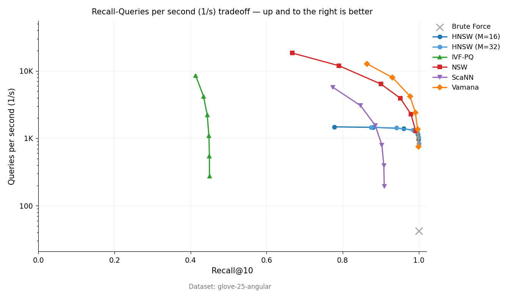

# vicinity

[](https://crates.io/crates/vicinity)
[](https://docs.rs/vicinity)

Approximate nearest-neighbor search.

## Install

Each algorithm is a separate feature. Enable what you need:

```toml
[dependencies]
vicinity = { version = "0.3", features = ["hnsw"] }          # graph index
# vicinity = { version = "0.3", features = ["ivf_pq"] }      # compressed index
# vicinity = { version = "0.3", features = ["nsw"] }         # flat graph
```

## Usage

### HNSW

High recall, in-memory. Best default choice.

```rust
use vicinity::hnsw::HNSWIndex;

let mut index = HNSWIndex::builder(128).m(16).ef_search(50).build()?;
index.add_slice(0, &[0.1; 128])?;
index.add_slice(1, &[0.2; 128])?;
index.build()?;

let results = index.search(&[0.1; 128], 5, 50)?;
// results: Vec<(doc_id, distance)>
```

### IVF-PQ

Compressed index. 32–64× less memory than HNSW, lower recall. Use for datasets that don't fit in RAM.

```rust
use vicinity::ivf_pq::{IVFPQIndex, IVFPQParams};

let params = IVFPQParams { num_clusters: 256, num_codebooks: 8, nprobe: 16, ..Default::default() };
let mut index = IVFPQIndex::new(128, params)?;
index.add_slice(0, &[0.1; 128])?;
index.add_slice(1, &[0.2; 128])?;
index.build()?;

let results = index.search(&[0.1; 128], 5)?;
```

## Benchmark

GloVe-25 (1.18M vectors, 25-d, cosine), Apple Silicon, single-threaded:

<p align="center">
  
</p>

Full numbers in [`doc/benchmark-results.md`](doc/benchmark-results.md).

## Algorithms

Indexes: HNSW, NSW, IVF-PQ, Vamana/DiskANN, ScaNN, SNG, DEG, KD-Tree, Ball Tree, RP-Forest, K-Means Tree.

Quantization: PQ, RaBitQ, SQ8.

Stable algorithms ship via named feature flags (`hnsw`, `nsw`, `ivf_pq`, `quantization`). Others are behind `experimental`.

See [docs.rs](https://docs.rs/vicinity) for the full API.

## License

MIT OR Apache-2.0
