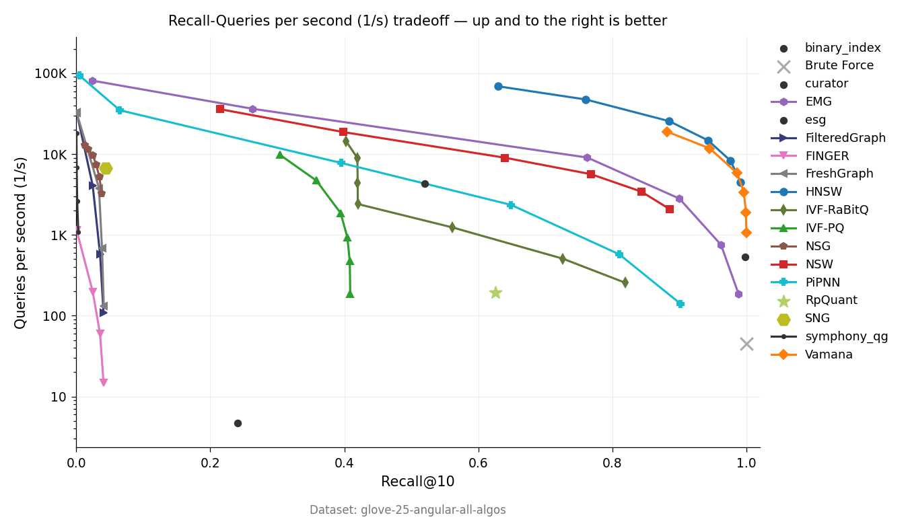

# Benchmark Results

Machine: Apple Silicon (M-series), single-threaded, `--release`.
Dataset: GloVe-25 (1.18M vectors, 25-d, cosine/angular), from ann-benchmarks.com.
Ground truth: brute-force cosine k-NN on L2-normalized vectors.
SIMD: `innr` (pure Rust SIMD, default feature).
QPS: sequential single-query throughput (queries / wall-clock seconds). 50-query warmup.

## Summary

| Algorithm | Best Recall@10 | QPS at best | Build (s) | Notes |
|-----------|---------------|-------------|-----------|-------|
| Brute | 100.0% | 45 | 0 | Exact baseline |
| Vamana | 100.0% | 998 | 2,237 | Full 1.18M dataset |
| HNSW | 99.1% | 4,496 | 180 | Full 1.18M dataset |
| EMG | 98.8% | 184 | 508 | Full 1.18M dataset |
| PiPNN | 90.1% | 140 | 589 | Full 1.18M dataset |
| NSW | 88.6% | 2,073 | 174 | Full 1.18M dataset |
| IVF-RaBitQ | 81.2% | 8 | 138 | Full 1.18M, 4-bit |
| RpQuant | 62.5% | 193 | 0.3 | Full 1.18M dataset |
| IVF-PQ | 40.9% | 187 | 491 | 5 codebooks on 25-d (known misconfiguration) |
| NSG | 3.8% | 3,263 | 7 | Capped at 50K (4.2% of GT) |
| SNG | 4.3% | 6,681 | 46 | Capped at 50K |
| Finger | 4.1% | 15 | 127 | Capped at 50K |
| FreshGraph | 4.1% | 132 | 104 | Capped at 50K |
| FilteredGraph | 4.1% | 108 | 127 | Capped at 50K |

NSG, SNG, Finger, FreshGraph, and FilteredGraph are capped at 50K vectors due to
construction cost. Their recall reflects the 50K/1.18M ground truth mismatch (~4.2%
expected), not algorithm quality. Within the 50K subset, these algorithms work correctly.

## Graph Indexes (Full Dataset)

### HNSW (M=16, ef_construction=200)

Build: 180s.

| ef_search | Recall@10 | QPS |
|-----------|-----------|-----|
| 10 | 62.9% | 69,176 |
| 20 | 76.0% | 47,416 |
| 50 | 88.5% | 25,562 |
| 100 | 94.3% | 14,742 |
| 200 | 97.6% | 8,304 |
| 400 | 99.1% | 4,496 |

### Vamana (R=64, ef_construction=200)

Build: 2,237s.

| ef_search | Recall@10 | QPS |
|-----------|-----------|-----|
| 10 | 88.2% | 18,393 |
| 20 | 94.5% | 11,292 |
| 50 | 98.6% | 5,620 |
| 100 | 99.6% | 3,246 |
| 200 | 99.9% | 1,823 |
| 400 | 100.0% | 998 |

### EMG (max_degree=32)

Build: 508s.

| ef_search | Recall@10 | QPS |
|-----------|-----------|-----|
| 10 | 2.4% | 81,125 |
| 20 | 26.2% | 36,457 |
| 50 | 76.2% | 9,070 |
| 100 | 90.0% | 2,815 |
| 200 | 96.2% | 754 |
| 400 | 98.8% | 184 |

### NSW (M=16)

Build: 174s.

| ef_search | Recall@10 | QPS |
|-----------|-----------|-----|
| 10 | 21.4% | 35,963 |
| 20 | 39.9% | 18,736 |
| 50 | 64.0% | 9,020 |
| 100 | 76.8% | 5,650 |
| 200 | 84.3% | 3,440 |
| 400 | 88.6% | 2,073 |

### PiPNN (max_degree=32, max_leaf_size=2048)

Build: 589s.

| ef_search | Recall@10 | QPS |
|-----------|-----------|-----|
| 20 | 6.5% | 34,881 |
| 50 | 39.5% | 7,786 |
| 100 | 64.9% | 2,255 |
| 200 | 81.0% | 576 |
| 400 | 90.1% | 140 |

## Partition-Based Indexes

### IVF-RaBitQ (256 clusters, 4-bit)

Build: 138s. Two-phase search: RaBitQ approximate shortlisting + exact reranking.

| nprobe | Recall@10 | QPS |
|--------|-----------|-----|
| 1 | 40.9% | 722 |
| 2 | 42.1% | 360 |
| 5 | 41.6% | 145 |
| 10 | 41.7% | 73 |
| 20 | 56.0% | 37 |
| 50 | 72.1% | 15 |
| 100 | 81.2% | 8 |

### IVF-PQ (256 clusters, 5 codebooks)

Build: 491s. Recall caps at ~41%: 5 codebooks over 25 dims = 5-d subspaces,
too coarse for 25-d data. Not a bug -- inherent quantization granularity.

| nprobe | Recall@10 | QPS |
|--------|-----------|-----|
| 1 | 30.3% | 9,842 |
| 5 | 39.4% | 1,866 |
| 10 | 40.5% | 934 |
| 50 | 40.9% | 187 |

### RpQuant (projected_dim=25, rerank=10)

Build: <1s. Single recall point: 62.5% at 193 QPS.

## Brute Force

Exact k-NN via exhaustive cosine: 100% recall at 45 QPS.

## Caveats

- All results on GloVe-25 (25 dims). Rankings may differ at higher dimensions.
- Build times and QPS are single-run wall-clock on a lightly loaded machine.
- NSG, SNG, Finger, FreshGraph, FilteredGraph are capped at 50K vectors
  during construction. Their low recall reflects the cap, not algorithm quality.
- IVF-PQ with 5 codebooks on 25-d is a known misconfiguration.

## References

- Malkov and Yashunin, "Efficient and Robust Approximate Nearest Neighbor
  using Hierarchical Navigable Small World Graphs." arXiv:1603.09320.
- Subramanya et al., "DiskANN: Fast Accurate Billion-point Nearest Neighbor
  Search on a Single Node." NeurIPS 2019.
- Yin et al., "delta-EMG: Error-bounded Monotonic Graph for ANN Search."
  arXiv:2511.16921.
- Gao and Long, "RaBitQ: Quantizing High-Dimensional Vectors with a
  Theoretical Error Bound." SIGMOD 2024. arXiv:2405.12497.
- Fu et al., "Fast Approximate Nearest Neighbor Search With The Navigating
  Spreading-out Graph." PVLDB 12(5), 2019.
- Rubel et al., "PiPNN: Partition-based Parallel Nearest Neighbor Search."
  arXiv:2602.21247.
